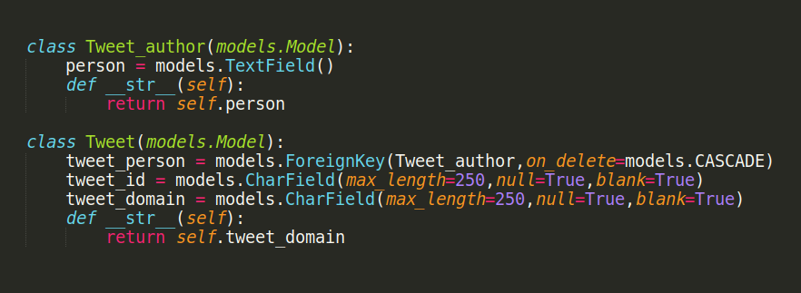

# TWITTER API WEBAPP

## Assignment for Vouch Insurtech Pvt.Ltd.

### Prerequisites
-   Python v3.8
-   Django Framework
-   HTML5, CSS3, Javascript
-   PIP Packages
-   Tweepy Twitter API

### Deployment

The website has been hosted on Pythonanywhere and can be easily accessed [here](http://s1mple9910.pythonanywhere.com/).

## Technology Stack

#### Frontend
-   HTML5
-   CSS3
-   Javascript
-   Bootstrap v4.3.1

#### Backend
-   Python v3.8
-   Django Framework
-   PIP Packages

#### Database
-   SQLite3 ( Relational Database )

## Why Django
-   Django is an open-source python web framework used for rapid development, pragmatic, maintainable, clean design, and secure websites.The main goal of the Django framework is to allow developers to focus on components of the application that are new instead of spending time on already developed components.


## Why SQLite3
-   SQLite allows a single database connection to access multiple database files simultaneously. This brings many nice features like joining tables in different databases or copying data between databases in a single command. SQLite is capable of creating in-memory databases that are very fast to work with.

## Folder Structure


# Approach
-   First, when the landing page of the website renders, the user has to click on 'Extract user data' to move to login page.


> Landing page view

## Login Implementation:-
-   When the User go to the Login Page and Click on the 'Login with Twitter' Button the user gets redirected to a Twitter Authentication Page where the User would have to fill their credentials and click on login, so the user would now be Authenticated and would be redirected to the Dashboard page.

## Logout Implementation:-
-   When the User Clicks on the Logout button on the Dashboard page the user is logged-out of the current Twitter session and then would be redirected to home page.

## Login Demo


> Login page


> Checkin Email view


## Logout Demo


> Post Logout page



> Database view with Author and Tweets Table.


## Dependencies
```
asgiref==3.2.10
certifi==2020.6.20
chardet==3.0.4
Django==3.1.2
idna==2.10
oauthlib==3.1.0
PySocks==1.7.1
pytz==2020.1
requests==2.24.0
requests-file==1.5.1
requests-oauthlib==1.3.0
six==1.15.0
sqlparse==0.3.1
tldextract==2.2.3
tweepy==3.9.0
urllib3==1.25.10

```

## Setup Enviroment Variables
-   Setup API keys to make get requests to the Twitter API Server.

1.  Create a `private.py` file in your Project folder and fill the following details:-

```
consumer_key = ''

consumer_secret_key = ''

bearer_token = ''

access_token = ''

access_token_secret = ''

SECRET_KEY = ''
```


## Installation for Local-Systems
1.  Create a folder 'Twitter_Api' in your home directory ` mkdir Twitter_Api `
2.  Copy the content of the zip to the folder.
3.  Enter the folder: ` cd Twitter_Api `
4.  Install dependencies: ` pip install -r requirements.txt `
5.  Start application: ` python3 manage.py startserver `
6.  Visit [http://localhost:8000]("http://localhost:8000") to view the application.

## Contact
-  Author: Amitesh Acharya
-  Email: amiteshacharya1@gmail.com

